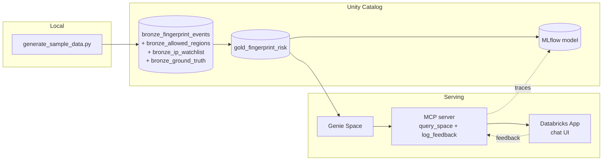

# GeoComply × Databricks - AI Dev Kit Workshop

A 2-hour hands-on session: use AI Dev Kit from your IDE (Claude Code, OpenCode, Cursor) to stand up a small fingerprint-risk pipeline on Databricks, train a model on it, and expose it through Genie + MCP + a chat app.

## What's in this repo

```
scripts/                     synthetic data generator + tunable config
  sample_data_config.yaml      knobs for population, anomalies, watchlist
  generate_sample_data.py      bootstraps deps, writes data/ outputs
data/                        generator output (gitignored, regenerate locally)
slides/                      workshop deck
CLAUDE.md                    project conventions for AI agents
README.md                    you are here
```

The repo is intentionally small. **Sample data is not committed.** Every workshop run regenerates it from `scripts/sample_data_config.yaml`.

## Architecture



## Prerequisites

- Databricks workspace with permission to create tables/volumes in a sandbox catalog/schema, and to create a Genie Space.
- AI Dev Kit installed in your IDE (Claude Code / OpenCode / Cursor). Install instructions are in the calendar invite.
- Python 3.10+ locally.

Target catalog/schema for the workshop: `gc_fpd_demo_catalog.geocomply_ai_workshop`. Naming conventions live in [CLAUDE.md](./CLAUDE.md).

## Activities

### 1. Generate data, load bronze, build the gold risk table

**1a. Generate sample data locally.** Outputs land in `data/` (gitignored).

```bash
python scripts/generate_sample_data.py
```

Defaults produce ~1.8M events / 5,000 devices / 30 days. Tune `scripts/sample_data_config.yaml` to scale up or change anomaly counts. `--dry-run` previews without writing.

The generator writes four files:

| File | Role |
|---|---|
| `fingerprint_events.parquet` | Raw event stream. One row per device ping. Pipeline input. |
| `allowed_regions.csv` | Per-account geofence config. Reference table. |
| `ip_watchlist.csv` | Bad-IP reputation list. Reference table. |
| `ground_truth.csv` | Planted-anomaly labels. **Validation only. Never read by the scoring pipeline.** |

The generator plants *realistic raw behaviors* (intercontinental jumps inside 30 minutes, shared device IDs across accounts, watchlist IP usage, country/hour drift). The scoring pipeline rediscovers them from the raw signal. Labels are held out and only used to measure recall.

**1b. Load bronze tables.** Upload the four files to a UC volume and load each into a `bronze_*` Delta table.

**1c. Build `gold_fingerprint_risk`** (one row per device) with five score columns, computed by SQL/Spark from bronze tables only:

| Score | Computed from | Range |
|---|---|---|
| `velocity_score` | max km/h between consecutive events on a device (haversine ÷ Δtime) | 0-1 |
| `geofence_score` | fraction of events from countries not in any of the device's accounts' allowed_regions | 0-1 |
| `device_sharing_score` | distinct accounts per device, log-scaled | 0-1 |
| `behavioral_drift_score` | Jaccard distance between (country, hour-bucket) sets in the first 21 days vs. the last 9 | 0-1 |
| `watchlist_score` | events on bad IPs (count or recency-weighted fraction) | 0-1 |

**1d. Validate.** Each score's top-N should overlap with the corresponding `bronze_ground_truth` anomaly.

**Output:** `gc_fpd_demo_catalog.geocomply_ai_workshop.gold_fingerprint_risk`.

### 2. Train a model and wire MLflow

- Add a synthetic `high_risk` label (rule on the five scores, or randomization).
- Train a simple classifier on `gold_fingerprint_risk`. Log params, metrics, and artifact to MLflow. Register a model version.
- Define the feedback payload schema you will log later: `query_text`, `genie_answer`, `label`, `model_version`, `timestamp`, optional `device_id`/`account_id`.

**Output:** an MLflow experiment with a registered model version and an agreed feedback schema.

### 3. Configure a Genie Space over the risk table

- Create a Genie Space connected to `gold_fingerprint_risk` (or a view).
- Add a one-line description and ~5 sample questions.
- Verify Genie produces runnable SQL whose answers match a hand-written validation query.

**Output:** Genie Space ID + URL.

### 4. Stand up the MCP server

Two tools, minimum:

- `query_space(space_id, query_text)` → forwards to Genie, returns answer (and SQL if available).
- `log_feedback(query_text, genie_answer, label, timestamp, ...)` → writes a record to MLflow as a trace, and/or appends to a `gold_feedback_events` table (Delta or Lakebase).

**Output:** an MCP endpoint URL exposing both tools.

### 5. Build the conversational app

A Databricks App with:

- Minimal chat UI (input + history).
- On send: call `query_space` via MCP, render the answer.
- On thumbs-up/down: call `log_feedback` via MCP.
- Optional: Lakebase as the persistence layer for feedback events and chat transcripts.

**Output:** working app URL. Chat over fingerprint risk data with HITL feedback flowing back to MLflow.

## Pre-workshop checklist

- Workspace access confirmed. You can create objects in `gc_fpd_demo_catalog.geocomply_ai_workshop`.
- AI Dev Kit working in your IDE.
- Python 3.10+ available. `python scripts/generate_sample_data.py --dry-run` runs without errors (smoke-test the generator before the session).
- (If using Lakebase) a Lakebase instance is available, or we have a plan to create one.
