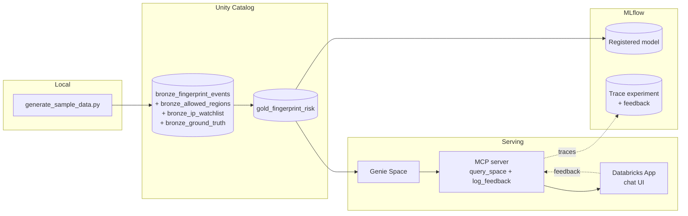

# GeoComply × Databricks - AI Dev Kit Workshop

A 2-hour hands-on session: use AI Dev Kit from your IDE (Claude Code, OpenCode, Cursor) to stand up a small fingerprint-risk pipeline on Databricks, train a model on it, and expose it through Genie + MCP + a chat app.

## What's in this repo

```
scripts/                     synthetic data generator + tunable config
  sample_data_config.yaml      knobs for population, anomalies, watchlist
  generate_sample_data.py      bootstraps deps, writes data/ outputs
data/                        generator output (gitignored, regenerate locally)
slides/                      workshop deck
CLAUDE.md                    project conventions for AI agents
README.md                    you are here
```

The repo is intentionally small. **Sample data is not committed.** Every workshop run regenerates it from `scripts/sample_data_config.yaml`.

## Architecture



## Prerequisites

- Databricks workspace with permission to create tables/volumes in a sandbox catalog/schema, and to create a Genie Space.
- AI Dev Kit installed in your IDE (Claude Code / OpenCode / Cursor). Install instructions are in the calendar invite.
- Python 3.10+ locally.

Pick your own catalog, schema, and volume for the workshop. The instructions below use `<catalog>.<schema>` and `<volume>` as placeholders. Naming conventions live in [CLAUDE.md](./CLAUDE.md).

## Activities

### 1. Generate data, load bronze, build the gold risk table

This activity produces a **continuously-refreshing pipeline**, not a one-off load. Bronze tables ingest new generator output incrementally as files land in the volume. Gold refreshes on top. Re-running the generator should produce updated risk scores without manual intervention.

**1a. Generate sample data locally.** Outputs land in `data/` (gitignored).

```bash
python scripts/generate_sample_data.py
```

Defaults produce ~1.8M events / 5,000 devices / 30 days. Tune `scripts/sample_data_config.yaml` to scale up or change anomaly counts. `--dry-run` previews without writing.

The generator writes four files:

| File | Role |
|---|---|
| `fingerprint_events.parquet` | Raw event stream. One row per device ping. Pipeline input. |
| `allowed_regions.csv` | Per-account geofence config. Reference table. |
| `ip_watchlist.csv` | Bad-IP reputation list. Reference table. |
| `ground_truth.csv` | Planted-anomaly labels. **Validation only. Never read by the scoring pipeline.** |

The generator plants *realistic raw behaviors* (intercontinental jumps inside 30 minutes, shared device IDs across accounts, watchlist IP usage, country/hour drift). The scoring pipeline rediscovers them from the raw signal. Labels are held out and only used to measure recall.

**1b. Load bronze tables.** Upload the four files to a UC volume. Build incremental `bronze_*` ingestion that picks up new files as the generator re-runs (Auto Loader or equivalent). One bronze table per file.

**1c. Build `gold_fingerprint_risk`** (one row per device) as a refreshable derived table with five score columns, computed from bronze tables only:

| Score | Computed from | Range |
|---|---|---|
| `velocity_score` | max km/h between consecutive events on a device (haversine ÷ Δtime) | 0-1 |
| `geofence_score` | fraction of events from countries not in any of the device's accounts' allowed_regions | 0-1 |
| `device_sharing_score` | distinct accounts per device, log-scaled | 0-1 |
| `behavioral_drift_score` | Jaccard distance between (country, hour-bucket) sets in the first 21 days vs. the last 9 | 0-1 |
| `watchlist_score` | events on bad IPs (count or recency-weighted fraction) | 0-1 |

**1d. Validate.** Each score's top-N should overlap with the corresponding `bronze_ground_truth` anomaly.

**Output:** `<catalog>.<schema>.gold_fingerprint_risk`.

### 2. Train a model and wire MLflow

- Add a synthetic `high_risk` label (rule on the five scores, or randomization).
- Train a simple classifier on `gold_fingerprint_risk`. Track the run in MLflow and register the resulting model in Unity Catalog so it has an addressable, versioned identity.

**Output:** an MLflow experiment with at least one registered model version, ready for downstream tools to reference.

### 3. Configure a Genie Space over the risk table

- Create a Genie Space connected to `gold_fingerprint_risk` (or a view).
- Add a one-line description and ~5 sample questions.
- Verify Genie produces runnable SQL whose answers match a hand-written validation query.

**Output:** Genie Space ID + URL.

### 4. Stand up the MCP server

Two tools, minimum:

- `query_space`: lets a caller ask the Genie Space a question and get back an answer. Each call should produce an inspectable record of what was asked and what came back, so the team can review behavior later without touching the chat UI.
- `log_feedback`: lets a caller record a user verdict (e.g. thumbs-up / thumbs-down) on a specific answer. The verdict should attach to the corresponding `query_space` record so the two are joined automatically in your LLMOps tooling.

**Output:** an MCP endpoint URL exposing both tools, with calls and feedback flowing into your team s LLMOps system of record (e.g. MLflow Traces).

### 5. Build the conversational app

A Databricks App with:

- Minimal chat UI (input + history).
- On send: ask the Genie Space via the MCP server, render the answer.
- On thumbs-up / thumbs-down: record the verdict via the MCP server so it lands on the same record as the underlying call.

**Output:** working app URL. Conversations and human verdicts are visible in your LLMOps tooling without further wiring, so the team can spot bad answers, find patterns, and feed reviewed examples back into evaluation.

## Pre-workshop checklist

- Workspace access confirmed. You can create catalogs/schemas/volumes/tables in your chosen workspace.
- AI Dev Kit working in your IDE.
- Python 3.10+ available. `python scripts/generate_sample_data.py --dry-run` runs without errors (smoke-test the generator before the session).
- (If using Lakebase) a Lakebase instance is available, or we have a plan to create one.
